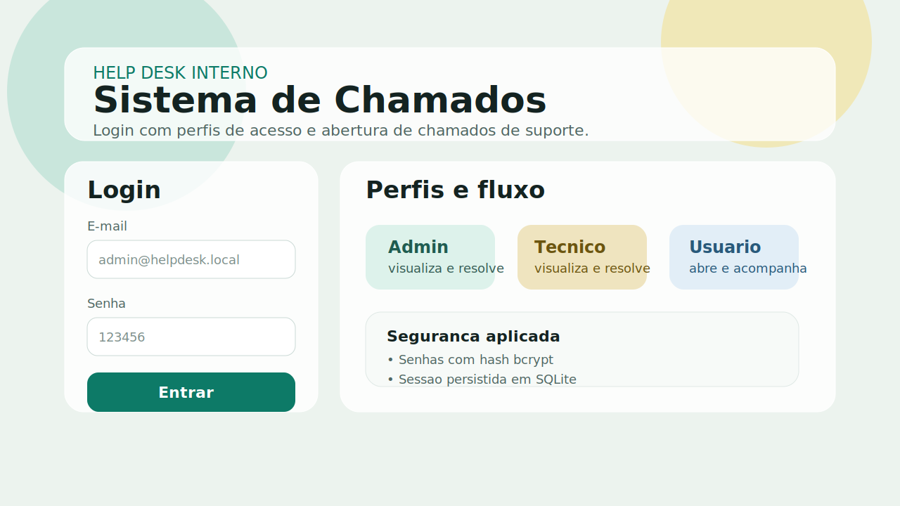
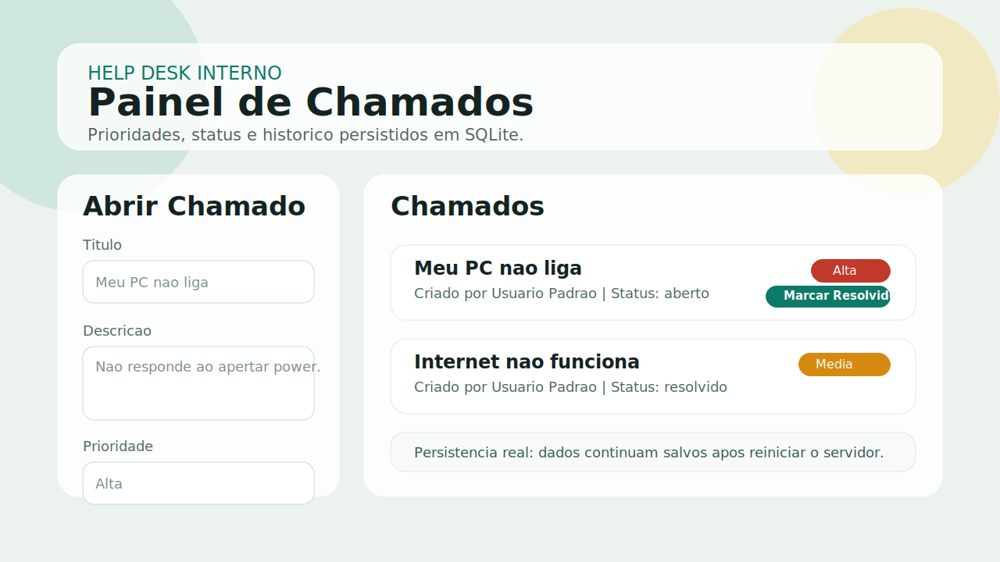

# Sistema de Chamados (Help Desk)

Projeto de Help Desk com TypeScript no backend e frontend, autenticação por perfis e persistência em SQLite.

## Visao Geral

Este projeto simula um fluxo real de suporte interno de TI: um usuário abre um chamado, acompanha o status e uma equipe técnica pode visualizar, priorizar e concluir o atendimento.

Ele foi construído para demonstrar fundamentos importantes de backend e frontend em um contexto de portfólio:

- autenticação com sessão
- autorização por perfil (RBAC)
- persistência com SQLite
- API REST com validações
- frontend em TypeScript consumindo a API

## Funcionalidades

- Login
- Perfis de acesso (admin, tecnico, usuario)
- Criar chamado
- Listar chamados
- Marcar chamado como resolvido
- Prioridade: alta, media e baixa

## Diferenciais Tecnicos

- Backend em TypeScript com Express
- Frontend em TypeScript compilado com esbuild
- Banco SQLite com criação automática das tabelas
- Sessões persistidas no banco
- Senhas protegidas com hash bcrypt
- Código comentado em pontos importantes para estudo

## Screenshots

### Tela de login e perfis



### Painel de chamados



## Tecnologias

- Backend: Node.js + Express + TypeScript
- Frontend: HTML, CSS + TypeScript (compilado para JS com esbuild)
- Banco de dados: SQLite

## Como executar

1. Instale dependencias:

```bash
npm install
```

2. Rode em modo desenvolvimento:

```bash
npm run dev
```

ou modo normal:

```bash
npm start
```

3. Abra no navegador:

- http://localhost:3000

## Login de demonstracao

- admin@helpdesk.local / 123456
- tecnico@helpdesk.local / 123456
- usuario@helpdesk.local / 123456

Regras de perfil:

- usuario: cria chamado e visualiza apenas os proprios
- tecnico: visualiza todos e pode resolver
- admin: visualiza todos e pode resolver

## API

### Login

`POST /api/auth/login`

Body JSON:

```json
{
  "email": "admin@helpdesk.local",
  "senha": "123456"
}
```

Resposta: token + usuario.

Use o header `Authorization: Bearer <token>` nas rotas protegidas.

### Usuario logado

`GET /api/auth/me`

### Logout

`POST /api/auth/logout`

### Criar chamado

`POST /api/tickets`

Body JSON:

```json
{
  "titulo": "Meu PC nao liga",
  "descricao": "Aperto o botao e nao inicia.",
  "prioridade": "alta"
}
```

### Listar chamados

`GET /api/tickets`

Filtros opcionais:

- `GET /api/tickets?status=aberto`
- `GET /api/tickets?status=resolvido`
- `GET /api/tickets?prioridade=alta`

### Resolver chamado

`PATCH /api/tickets/:id/resolve`

Exemplo:

`PATCH /api/tickets/1/resolve`

## Observacoes

- Os dados ficam persistidos em `data/helpdesk.sqlite`.
- As senhas demo sao armazenadas com hash bcrypt no banco.
- O projeto foi pensado para estudo e portfólio, então prioriza clareza de arquitetura e facilidade de execução local.

## Como Explicar o Projeto

### Resumo curto para recrutador

"Desenvolvi um sistema de chamados com Node.js, TypeScript e SQLite. Implementei autenticação com sessão, autorização por perfil, persistência de chamados e frontend integrado consumindo uma API REST. Também apliquei hash de senha com bcrypt e organizei o projeto para rodar localmente com setup simples."

### Explicacao tecnica em etapas

1. O backend inicia criando as tabelas automaticamente no SQLite (`users`, `sessions`, `tickets`).
2. Existe um seed de usuários demo para facilitar testes locais e apresentação do sistema.
3. O login valida a senha com bcrypt, gera um token e salva a sessão no banco.
4. Cada rota protegida lê o token e recupera o usuário autenticado.
5. A regra de perfis controla o que cada usuário pode fazer no sistema.
6. Os chamados ficam persistidos no banco, então o projeto mantém histórico mesmo após reiniciar o servidor.

### O que este projeto demonstra

- modelagem básica de banco relacional
- API REST com regras de negócio
- autenticação e autorização
- integração full stack
- preocupação com segurança básica
